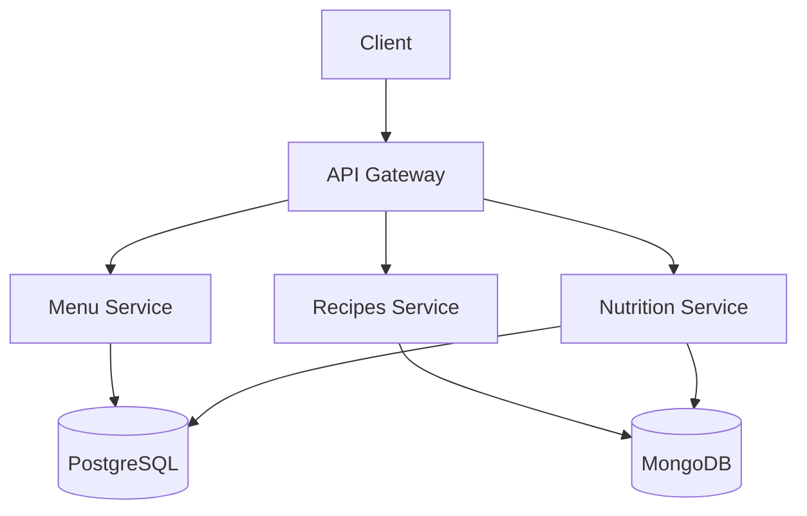

# JustMeal 🍽️

**Your Smart Weekly Meal Planner with Automated Recipes and Nutrition Tracking**

[](https://golang.org/)
[](https://www.postgresql.org/)
[](https://www.mongodb.com/)
[](https://gin-gonic.com/)
[](https://opensource.org/licenses/MIT)


## 🌟 Features

### 🗓️ Smart Weekly Planning
- Auto-generate balanced meal plans for 7 days
- Drag-and-drop meal arrangement interface
- Shopping list generator

### 🥗 Nutrition First
- Detailed KБЖУ (calories, proteins, fats, carbs) tracking
- Dietary preferences support (Keto, Vegan, Gluten-free)
- Daily nutrition goals monitoring

### 🧑🍳 Chef's Companion
- 5000+ recipes with step-by-step instructions
- Cooking timer and video guides
- Portion size calculator

### ⚙️ Tech Highlights
- Dual database support (PostgreSQL + MongoDB)
- Blazing fast REST API with Gin
- Modern microservices architecture
- Docker-ready deployment

## 🚀 Quick Start

```bash
# Clone repository
git clone https://github.com/justsquad/justmeal.git

# Setup environment
cp .env.example .env
nano .env  # Configure your database

# Run with Docker
docker-compose up -d
```

## 📚 API Examples

```bash
# Create new dish
curl -X POST -H "Content-Type: application/json" -d '{
  "name": "Avocado Toast",
  "meal_type": "breakfast",
  "ingredients": [{"name": "Avocado", "quantity": "1 piece"}],
  "nutrition": {"calories": 250, "protein": 5, "fat": 18, "carbs": 20}
}' http://localhost:8080/api/v1/dishes

# Generate weekly menu
curl -X POST -H "Content-Type: application/json" -d '{
  "preferences": ["vegetarian", "low-carb"],
  "days": 7
}' http://localhost:8080/api/v1/plans

# Get nutrition report
curl http://localhost:8080/api/v1/nutrition/weekly
```

## 🛠️ Architecture



## 🌱 Why Choose JustMeal?

✅ **Save 5+ Hours Weekly** on meal planning  
✅ **Reduce Food Waste** with smart portioning  
✅ **Eat Healthier** with AI-powered suggestions  
✅ **Learn Cooking** with chef-curated recipes  

## 💡 Core Technologies

- **Go 1.22** - High-performance backend
- **PostgreSQL** - Relational data storage
- **MongoDB** - Flexible recipe storage
- **Gin Framework** - Lightning-fast HTTP routes
- **pgx** - Advanced PostgreSQL driver
- **Docker** - Containerized deployment

## 🤝 Contribution

We ❤️ contributors! Check our [Contribution Guide](CONTRIBUTING.md) and join our:

[](https://discord.gg/your-invite)
[](https://t.me/bald_man_g)

## 📄 License

MIT © 2024 JustSquad Team